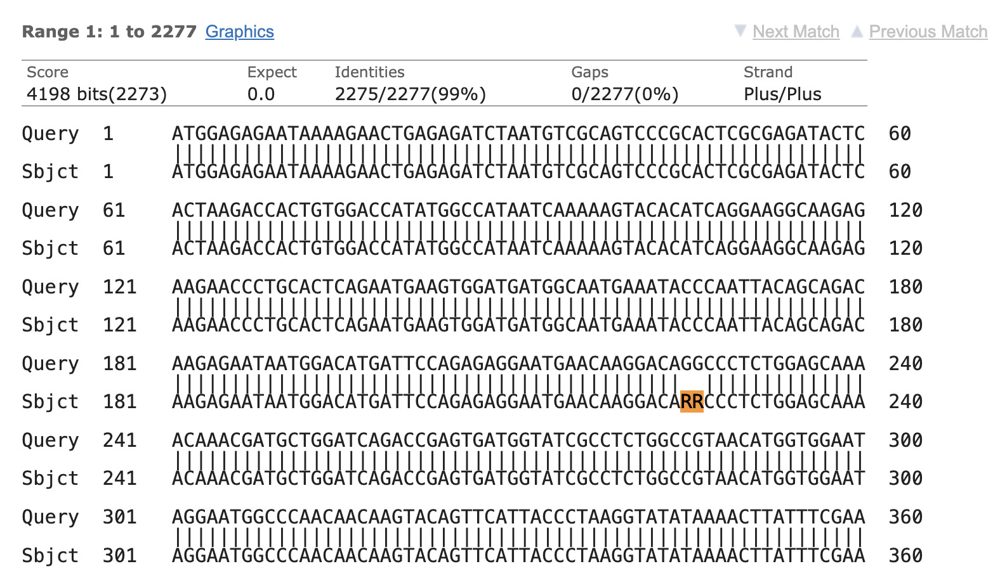

Researchers working with RNA viruses often face a major dilemma: **how to select the right reference genome**? On top of that, traditional analysis pipelines are often **overly complex and cumbersome**, making them extremely difficult for researchers without a strong bioinformatics background to use.

After attempting various complex manual scripts, I finally locked onto the **IRMA (Iterative Refinement Meta-Assembler)** pipeline. It stands out because it is **simple, fast, and accurate**. It automates the tedious reference selection process, making it a friendly tool for everyone.



## 1. What is IRMA?

IRMA was designed for the robust assembly, variant calling, and phasing of highly variable RNA viruses. Currently IRMA is deployed with modules for influenza, ebolavirus and coronavirus. IRMA is free to use and parallelizes computations for both cluster computing and single computer multi-core setups.

## 2. Download & Installation (via Conda)

The most convenient way to install IRMA and manage its complex dependencies (Perl, SAMtools, SSW) is via **Conda** (or Mamba).

* **Project Homepage**: [IRMA - CDC](https://wonder.cdc.gov/amd/flu/irma/)
* **Bioconda Page**: [bioconda/irma](https://bioconda.github.io/recipes/irma/README.html)

### 💻 Installation Steps

1.  It is strongly recommended to create a dedicated environment to avoid version conflicts. Open your terminal and run:
    ```bash
    conda create -n irma_env -c bioconda irma
    ```
2.  Activate the environment before use:
    ```bash
    conda activate irma_env
    ```

> [!WARNING]+ Common Error: PackagesNotFoundError
> When trying to install, you might see an error indicating the package cannot be found:
>
> **PackagesNotFoundError: The following packages are not available from current channels:**
>
> This happens because IRMA is hosted on specific bioinformatics channels (Bioconda) which might not be in your default configuration.

### ✅ Fix Method

We need to configure the Conda channel priority correctly. Please operate according to the following steps:

1.  **Add necessary channels** in the correct order (priority matters):
    ```bash
    conda config --add channels defaults
    conda config --add channels conda-forge
    conda config --add channels bioconda
    ```
2.  **Set strict channel priority** (optional but recommended for stability):
    ```bash
    conda config --set channel_priority strict
    ```
3.  **Retry the installation** command.

> [!NOTE]
> If the dependency solving is too slow with standard `conda`, I highly recommend using **Mamba**:
> `mamba create -n irma_env -c bioconda irma`

## 3. The Workflow: Assembly & Validation

This section outlines the complete process of running the assembly and immediately verifying the results using NCBI's web tools to validate the results.

### Step 1: Run the Assembly
To assemble an Influenza sample (using the built-in `FLU` module):

```bash
# 1. Ensure environment is active
conda activate irma_env

# 2. Run assembly
# Syntax: IRMA <MODULE-config> <R1.fastq.gz/R1.fastq> <R2.fastq.gz/R2.fastq> [path/to]<sample_name> [options]
IRMA FLU Sample1_R1.fastq.gz Sample1_R2.fastq.gz Sample1
```

Once finished, the key output file will be located at:
`./Sample1/amended_consensus/Sample1_*.fa`

### Step 2: Validate with NCBI BLAST (Two Sequences)

IRMA is undeniably simple and user-friendly, but **how about its accuracy**? To find out, I compared the sequence generated by my previously defined custom pipeline against the IRMA result using the **NCBI BLAST "Align two or more sequences"** feature.

1.  **Go to NCBI BLAST**: Open the [Standard Nucleotide BLAST](https://blast.ncbi.nlm.nih.gov/Blast.cgi?PROGRAM=blastn) page.
2.  **Enable Pairwise Alignment**:
    * Find and check the box **"Align two or more sequences"**.
    * *This splits the input interface into "Query Sequence" and "Subject Sequence" sections.*
3.  **Upload Sequences**:
    * **Query Sequence (Top Box)**: Upload or paste your IRMA output (`MySampleName.fasta`).
    * **Subject Sequence (Bottom Box)**: Upload or paste the standard viral reference genome (e.g., A/California/07/2009).
4.  **Run BLAST**: Click the "BLAST" button.

### Step 3: Interpreting Mismatches & AA Changes

After the alignment was complete, I found that the **Per.Ident** was **99.91%**, indicating that there were some mismatched bases. To compare further, we need to follow these steps:

1.  **Switch to Alignments**: Click the **"Alignments"** tab (located next to the *Graphic Summary*).
2.  **Scan for Breaks**: Scroll down to see the base-by-base alignment. Look for breaks in the vertical lines (`|`):
    * **Line Present (`|`)**: The bases are identical.
    * **No Line / Gap**: This indicates a mismatch or indel.
3.  **Check the Position**:
    * **Ends of Sequence**: If the mismatch is at the very start or end, it is likely a sequencing artifact or trimming issue.
    * **Middle of Sequence**: If the mismatch is in the middle, it is likely a real biological mutation.
4.  **Analyze Mismatches**:
    Check specific alignment rows (e.g., `Sbjct 181`). For instance, around **228-229 bp**:
    ```text
    Query (Pipeline): ...AACAAGGACAGGCCCT...
    Sbjct (IRMA):     ...AACAAGGACARRCCCT...
    ```
    Notice that the IRMA result (Sbjct) uses **RR**, while my custom pipeline (Query) uses **GG**. In bioinformatics (IUPAC nomenclature), **R** stands for **Purine (A or G)**.
    * **Interpretation**: Biologically speaking, the IRMA result is **reliable** here. It likely detected a mixed base and conservatively preserved the ambiguity, whereas my custom pipeline was more aggressive in determining the specific base as **G**.
      


> [!TIP]+ Analysis Goal
> 
> If the mismatch is in the **middle**, map this coordinate to the gene's reading frame to see if the codon changes (e.g., `GCA` -> `GCC` is synonymous, but `GCA` -> `GTA` changes Alanine to Valine).

## 4. Conclusion

If you just want to simply check for sequence variations, I believe this software is sufficient because it is simple and fast.

However, if you are dealing with an **unknown RNA virus**, I think you should perform a BLAST search first to select the appropriate module, or adopt a step-by-step analysis using software specifically suitable for your sequences.

Happy Assembling! 🧪
