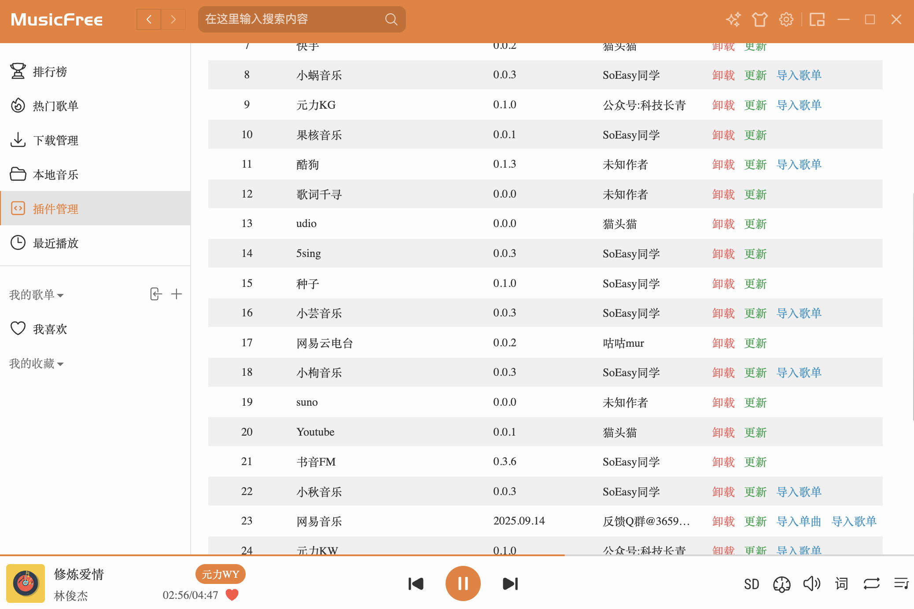

Friends working overseas likely have a major pain point in their daily work: **music copyright restrictions**. The habitually used NetEase Cloud and QQ Music have most playlists turned grey due to regional restrictions.

After attempting various solutions, I finally locked onto the **MusicFree** open-source project. It does not store music, but aggregates network-wide resources through plugins. This blog post mainly records the configuration process, hoping it can help everyone.



## 1. What is MusicFree?

MusicFree is essentially a **local player shell**.

* **Decentralized**: The software itself has no song data.
* **Plugin-based**: Through importing JavaScript plugins, it can fetch audio interfaces from platforms like NetEase, QQ, Kugou, Bilibili, etc.
* **Ad-free**: Completely open-source and free, without various pop-ups and membership restrictions.

## 2. Download & Installation

Go to the project's GitHub Releases page or use the mirror link below to download.

* **Project Homepage**: [MusicFree](https://github.com/maotoumao/MusicFree)
* **Mac Users**: If using an M-chip (M1/M2/M3), please download the `.arm64.dmg` installation package.
    * [Click to Download (Feishu Mirror Source)](https://r0rvr854dd1.feishu.cn/drive/folder/GBPgfIRA4luHFKdTmOfcv6H9nXe)

> [!WARNING]+ Common Error: File is Damaged
> When installing and opening for the first time on macOS (especially M series chips), the system often pops up the following blocking prompt:
>
> **“MusicFree” is damaged and can’t be opened. You should move it to the Bin.**
>
> This is not really because the software is broken, but because the macOS Gatekeeper mechanism blocked the open-source software without an official Apple signature.

### ✅ Fix Method

We need to use terminal commands to remove the file's "quarantine attribute". Please operate according to the following steps:

1.  Open **Terminal**.
2.  Enter the following command (note there is a space after `cr`):
    ```bash
    sudo xattr -cr /Applications/MusicFree.app
    ```
3.  Enter computer password and press Enter (screen will not display characters when typing).

> [!NOTE]
> If you haven't dragged the software into the "Applications" folder, you can also type `sudo xattr -cr ` first, then directly drag the MusicFree icon into the terminal window, and the path will auto-complete.

After completion, click the APP again, and it can be opened normally.

## 3. Configuring Plugin Sources (Core Step)

After opening the software, you need to import plugins to be able to search for songs.

1.  Click **"Plugin Management"** in the left sidebar.
2.  Click **"Install from Network"**.
3.  Copy the following JSON link and fill it in:

> [!TIP]+ Recommended Plugin Source
> This is an aggregation source with relatively complete collection:
>
> [Click here to copy the Plugin Source JSON](https://raw.gitcode.com/maotoumao/MusicFreePlugins/raw/master/plugins.json)
> 
> *Note: If the link above is invalid, you can Google search for other plugin sources yourself.*

## 4. Usage Experience

After configuration is complete, click the **Search** icon on the left to aggregate search for network-wide music.

**Main Feature Recommendations:**
* **Import Playlist**: Supports directly pasting NetEase or QQ Music playlist links to sync your favorites.
* **High Quality Download**: Most songs support lossless quality download.
* **Lyrics Display**: Supports desktop lyrics and cover display.

For friends in overseas or specific copyright-restricted regions, hope everyone can Happy Listening! 🎵
