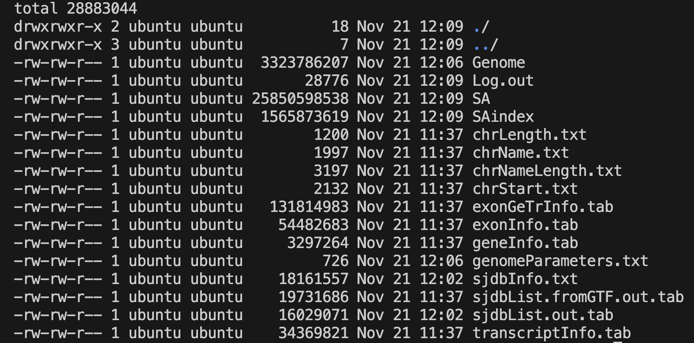

This guide outlines a standardized, reproducible pipeline for RNA-seq data analysis. It is divided into two main sections:
1.  **Upstream Analysis:** Processing raw sequencing data in a Linux environment.
2.  **Downstream Analysis:** Statistical modeling and visualization using R.

---

## Part 1: Upstream Analysis (Linux Environment) 🐧

### 1. Environment & Directory Structure

**Software Prerequisites:**
To ensure reproducibility and avoid dependency conflicts, it is highly recommended to use **Conda** (or the faster **Mamba**) for environment management.

* **fastp**: An ultra-fast all-in-one FASTQ preprocessor (QC + Trimming).
* **STAR**: Spliced Transcripts Alignment to a Reference (Industry standard aligner).
* **subread**: A package containing `featureCounts` for efficient quantification.
* **samtools**: The swiss-army knife for BAM/SAM file manipulation.

**Step 1: Setup Conda Environment:**
Run the following commands to create a dedicated environment and install all necessary tools from the `bioconda` channel.

```bash
# 1. Create a new environment named 'rnaseq'
conda create -n rnaseq

# 2. Activate the environment
conda activate rnaseq

# 3. Install software (Using mamba is recommended for speed, but conda works too)
# We explicitly specify channels to ensure correct versions
conda install -c bioconda -c conda-forge fastp star subread samtools

# 4. Verify installation
fastp --version
STAR --version
featureCounts -v
samtools --version
```

**Step 2: Directory Initialization:**
A clean folder structure is the foundation of reproducible research. Run the following commands in your project root to initialize the workspace:

```bash
# Create standard directory structure
mkdir -p 00.RawData    # Store raw FASTQ files here
mkdir -p 01.CleanData  # Store filtered/trimmed FASTQ files
mkdir -p 02.Genome     # Store reference genome (FASTA) and annotation (GTF)
mkdir -p 03.Align      # Store alignment results (BAM files)
mkdir -p 04.Counts     # Store final expression matrix
```

### 2. Reference Preparation

You need to download the reference genome (**FASTA**) and the gene annotation file (**GTF**). Common sources include Ensembl, GENCODE, or UCSC.

* **FASTA (.fa)**: The actual DNA sequence of the genome.
* **GTF (.gtf)**: The map telling software where genes, exons, and transcripts are located.

```bash
cd 02.Genome

# Download hg38 (GRCh38) genome sequence
wget https://ftp.ebi.ac.uk/pub/databases/gencode/Gencode_human/release_49/GRCh38.primary_assembly.genome.fa.gz

# Download corresponding annotation
wget https://ftp.ebi.ac.uk/pub/databases/gencode/Gencode_human/release_49/gencode.v49.annotation.gtf.gz

# Decompress files (STAR requires uncompressed FASTA usually)
gunzip *.gz
```

### 3. Build Index

Before alignment, STAR must generate a genome index. This step is computationally intensive but only needs to be performed **once** per genome version.

```bash
# Ensure you are in the 02.Genome directory
STAR --runMode genomeGenerate \
     --runThreadN 16 \
     --genomeDir ./star_index \
     --genomeFastaFiles GRCh38.primary_assembly.genome.fa \
     --sjdbGTFfile gencode.v49.annotation.gtf \
     --sjdbOverhang 149
```


> **📝 Parameter Explanation:**
> * `--runMode genomeGenerate`: Switches STAR to index-building mode (default is alignment mode).
> * `--runThreadN 16`: Uses 16 CPU threads. **Adjust this based on your server's capacity** to speed up the process.
> * `--genomeDir ./star_index`: Specifies the output directory for the index files.
> * `--sjdbGTFfile`: Providing the GTF file here improves alignment accuracy specifically across splice junctions.
> * `--sjdbOverhang 149`: **Critical Parameter**. Ideally set to `ReadLength - 1`. For standard Illumina PE150 (150bp) sequencing, use 149. If you have PE100 data, set this to 99.

> **❓ How to determine the correct `sjdbOverhang`?**
>
> The general formula is: **`Read Length - 1`**.
>
> If you are unsure about your sequencing read length (e.g., PE150 vs PE100), use one of the following methods:
>
> * **Method A (Check Report):** Open the `fastp.html` report generated in Step 4 (run fastp first if needed). Look at the **"Summary"** table -> **"Read1 before filtering"** -> **"mean length"**.
> * **Method B (Command Line):** Run this command to directly count the length of the first read in your raw data:
>     ```bash
>     # Print the length of the first sequence line
>     zcat ../00.RawData/Sample1_1.fq.gz | head -n 2 | tail -n 1 | awk '{print length}'
>     ```
> * **Common Values:**
>     * If output is **150** (Standard Illumina PE150) $\rightarrow$ set overhang to **149**.
>     * If output is **100** (Illumina PE100) $\rightarrow$ set overhang to **99**.

### 4. QC & Trimming

We use `fastp` because it performs quality control and adapter trimming in a single pass, making it significantly faster than combining FastQC and Trimmomatic.

Assuming Paired-End (PE) data named `Sample1_1.fq.gz` and `Sample1_2.fq.gz`:

```bash
cd ../01.CleanData

fastp -i ../00.RawData/Sample1_1.fq.gz \
      -I ../00.RawData/Sample1_2.fq.gz \
      -o Sample1_1.clean.fq.gz \
      -O Sample1_2.clean.fq.gz \
      -h Sample1.fastp.html \
      -j Sample1.fastp.json \
      --detect_adapter_for_pe \
      -w 8
```

> **📝 Parameter Explanation:**
> * `-i / -I`: Input files (Read 1 and Read 2).
> * `-o / -O`: Output cleaned files.
> * `-h`: Generates a visual HTML report. **Always download and open this file** to check sequencing quality, duplication rates, and adapter content.
> * `--detect_adapter_for_pe`: Automatically detects and trims adapter sequences without needing manual input.
> * `-w 8`: Uses 8 threads for parallel processing.

### 5. Alignment

This is the core step where cleaned reads are mapped to the genome index.

```bash
cd ../03.Align

STAR --runThreadN 16 \
     --genomeDir ../02.Genome/star_index \
     --readFilesIn ../01.CleanData/Sample1_1.clean.fq.gz ../01.CleanData/Sample1_2.clean.fq.gz \
     --readFilesCommand zcat \
     --outFileNamePrefix Sample1_ \
     --outSAMtype BAM SortedByCoordinate \
     --outBAMsortingThreadN 8 \
     --quantMode GeneCounts
```

> **📝 Parameter Explanation:**
> * `--readFilesCommand zcat`: Tells STAR that input files are gzipped (`.gz`), so it uses `zcat` to read them on the fly.
> * `--outSAMtype BAM SortedByCoordinate`: **Highly Recommended**. Directly outputs a binary BAM file sorted by genomic coordinates. This saves disk space (vs SAM) and saves time (skips manual sorting with `samtools sort`).
> * `--quantMode GeneCounts`: Outputs a basic `ReadsPerGene.out.tab` count file. While we will use featureCounts later, this provides a quick "sanity check" to ensure mapping worked.

### 6. Quantification

Finally, we count how many reads map to each gene using `featureCounts` from the Subread package.

```bash
cd ../04.Counts

# Quantify all BAM files in the Align directory at once
featureCounts -T 16 \
              -p \
              -t exon \
              -g gene_id \
              -a ../02.Genome/gencode.v49.annotation.gtf \
              -o all_counts.txt \
              ../03.Align/*.bam
```

> **📝 Parameter Explanation:**
> * `-T 16`: Usage of 16 threads.
> * `-p`: **Crucial for PE data**. Specifies that the input is Paired-End. Do not use this for Single-End data.
> * `-t exon`: Specifies the feature type to count. We count reads aligning to `exon` regions.
> * `-g gene_id`: Specifies the attribute type to summarize by. We want counts per `gene_id` (meta-feature), grouping all exons belonging to one gene.
> * `../03.Align/*.bam`: The wildcard `*` allows processing all samples simultaneously, creating a single merged expression matrix.

---

## Part 2: Downstream Analysis (R Environment) 📊

Once you have generated `all_counts.txt` and prepared your `metadata.txt` (sample grouping info), switch to RStudio.

### 1. Setup & Data Import

```R
# Install packages if missing
# BiocManager::install(c("DESeq2", "tidyverse", "pheatmap", "clusterProfiler", "org.Hs.eg.db"))

library(DESeq2)
library(tidyverse)

# 1. Load Data
counts_data <- read.table("counts.txt", header=TRUE, row.names=1, sep="\t")
col_data <- read.table("metadata.txt", header=TRUE, row.names=1, sep="\t")

# Sanity Check: Verify consistency between data and metadata
# The rows of metadata MUST match the columns of count data exactly
if(!all(rownames(col_data) == colnames(counts_data))) {
  stop("Error: Sample names in col_data and counts_data do not match!")
}

# 2. Set Factors
# Define the reference level for comparison (e.g., Control/Mock)
col_data$Condition <- factor(col_data$Condition, levels = c("Mock", "Infected"))
```

### 2. DESeq2 Workflow

We use **DESeq2** for differential expression analysis as it robustly handles biological variability and low-count genes.

```R
# Construct DESeqDataSet Object
dds <- DESeqDataSetFromMatrix(countData = counts_data,
                              colData = col_data,
                              design = ~ Condition)

# Pre-filtering: Remove rows with very low counts
# This reduces the size of the object and increases calculation speed
keep <- rowSums(counts(dds)) >= 10
dds <- dds[keep, ]

# Run the full differential expression pipeline
dds <- DESeq(dds)
```

### 3. QC: Principal Component Analysis (PCA)

PCA projects high-dimensional data into 2D space. It is the best tool to visualize sample clustering and detect potential outliers or batch effects.

```R
# Variance Stabilizing Transformation (VST)
# VST normalizes data so that variance is not dependent on the mean
vsd <- vst(dds, blind=FALSE)

# Plot PCA
plotPCA(vsd, intgroup="Condition")
```

### 4. Extract Differentially Expressed Genes (DEGs)

```R
# Extract results: Infected vs Mock
res <- results(dds, contrast=c("Condition", "Infected", "Mock"))

# LFC Shrinkage
# Shrinks log2 fold changes for genes with low expression or high dispersion
# This provides more accurate rankings for visualization
resLFC <- lfcShrink(dds, contrast=c("Condition", "Infected", "Mock"), type="normal")

# Convert to Dataframe for filtering
res_df <- as.data.frame(res)

# Filter Significant Genes
# Common threshold: Adjusted P-value < 0.05 and Fold Change > 2 (|log2FC| > 1)
sig_genes <- res_df %>%
  filter(padj < 0.05 & abs(log2FoldChange) > 1)

# Save results
write.csv(sig_genes, "Diff_Genes_Infected_vs_Mock.csv")
```

### 5. Visualization

#### A. Volcano Plot 🌋

Visualizes the relationship between statistical significance (`padj`) and magnitude of change (`log2FoldChange`).

```R
library(ggplot2)

# Annotate Up/Down regulation for coloring
res_df$diff <- "NO"
res_df$diff[res_df$log2FoldChange > 1 & res_df$padj < 0.05] <- "UP"
res_df$diff[res_df$log2FoldChange < -1 & res_df$padj < 0.05] <- "DOWN"

# Plot
ggplot(res_df, aes(x=log2FoldChange, y=-log10(padj), color=diff)) +
  geom_point(alpha=0.5) +
  theme_minimal() +
  scale_color_manual(values=c("blue", "grey", "red")) +
  geom_vline(xintercept=c(-1, 1), lty=2, color="black") +
  geom_hline(yintercept=-log10(0.05), lty=2, color="black") +
  labs(title = "Volcano Plot", x = "log2 Fold Change", y = "-log10(Adjusted P-value)")
```

#### B. Heatmap 🔥

Visualizes the expression patterns of significant genes across all samples.

```R
library(pheatmap)

# Extract expression matrix for only the significant genes
sig_gene_names <- rownames(sig_genes)
mat <- assay(vsd)[sig_gene_names, ]

# Plot Heatmap
# scale="row": Z-score standardization per gene to highlight patterns relative to the mean
pheatmap(mat, 
         scale="row", 
         show_rownames=FALSE, 
         annotation_col=col_data,
         main = "Expression Heatmap of DEGs")
```

### 6. Functional Enrichment (GO & KEGG) 🧬

Translating gene lists into biological insights using `clusterProfiler`.

```R
library(clusterProfiler)
library(org.Hs.eg.db)

# Convert IDs: Ensembl -> Entrez
# clusterProfiler requires Entrez IDs for accurate mapping
gene_list <- rownames(sig_genes)
entrez_ids <- bitr(gene_list, fromType="ENSEMBL", toType="ENTREZID", OrgDb="org.Hs.eg.db")

# 1. GO Enrichment (Biological Process)
ego <- enrichGO(gene = entrez_ids$ENTREZID,
                OrgDb = org.Hs.eg.db,
                ont = "BP",
                pAdjustMethod = "BH",
                pvalueCutoff = 0.05)
dotplot(ego, showCategory=20, title="GO Biological Process Enrichment")

# 2. KEGG Pathway Enrichment
kk <- enrichKEGG(gene = entrez_ids$ENTREZID,
                 organism = 'hsa', # 'hsa' for Homo sapiens
                 pvalueCutoff = 0.05)
dotplot(kk, title="KEGG Pathway Enrichment")
```
